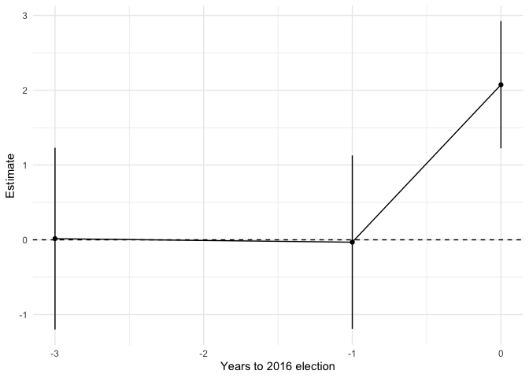
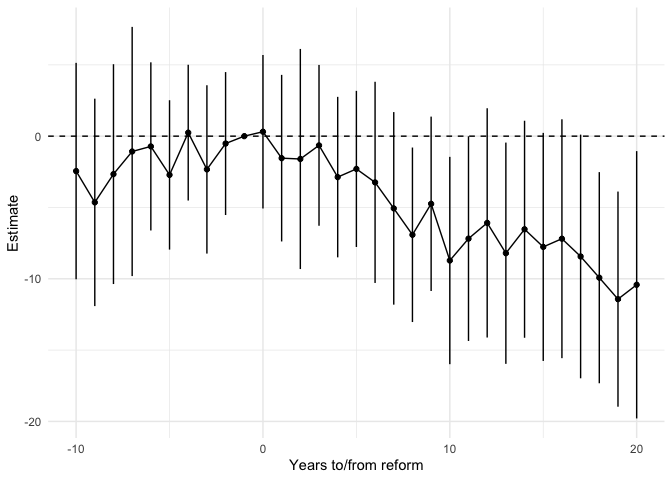

dd - Tools to estimate difference-in-differences models with leads and
lags in R
================

The `dd` package provides two effective helper functions to estimate and
visualize a difference-in-differences model (DD) with leads and lags.
Studies using such specifications are often referred to as (panel) event
studies in economics.

The function `code_eventtime` generates a time-to-treatment factor
variable which is broken out into dummies capturing leads and lags when
added to a typical model fitting function in R (such as `lm` or `felm`).

The function `tidy_eventcoef` uses the `tidy` function family from the
[`broom` package](https://broom.tidymodels.org/) to extract the
coefficients for the leads and lags and prepares a data frame suitable
to pass to `ggplot` for plotting.

To install the `dd` package, use:

``` r
remotes::install_github("sumtxt/dd")
```

The command [`eventdd`](http://ftp.iza.org/dp13524.pdf) provides similar
functionality in Stata but bundled with code for model estimation (which
this R package leaves up to the user for added flexibility).

### Multi-period DiD Example

[Dinas, Matakos, Xefteris and Hangartner
(2019)](https://doi.org/10.1017/pan.2018.48) show that the exposure to
the European refugee protection crisis in 2015/16 increased support for
the Golden Dawn, a radical right party in Greece.

Their data is a balanced panel of vote shares from 4 elections covering
95 municipalities on islands in the Aegean Sea. Some islands close to
the Turkish border experienced a sudden and drastic increase in the
number of Syrian refugees before the 2016 elections.

In code below, `code_eventtime` adds a time-to-event variable to the
data frame which is then used in the subsequent two-way fixed effect
regression. Next, the estimates are extracted via `tidy_eventcoef` and
passed to ggplot.

``` r
library(ggplot2)
library(dd)
library(lfe)

data(goldendawn)
with(goldendawn, table(year, post))
#>       post
#> year    0  1
#>   2012 95  0
#>   2013 95  0
#>   2015 95  0
#>   2016 83 12

goldendawn$t <- code_eventtime(
         unit=muni,
         time=year,
         treat=post,
         data=goldendawn)

m <- felm(gd ~ t | muni + year | 0 | muni, 
  data=goldendawn)
summary(m)
#> 
#> Call:
#>    felm(formula = gd ~ t | muni + year | 0 | muni, data = goldendawn) 
#> 
#> Residuals:
#>    Min     1Q Median     3Q    Max 
#> -4.589 -0.521  0.001  0.441  7.000 
#> 
#> Coefficients:
#>     Estimate Cluster s.e. t value Pr(>|t|)
#> t-3   0.0155       0.6120    0.03     0.98
#> t-1  -0.0319       0.5844   -0.05     0.96
#> t0    2.0733       0.4281    4.84 0.000005
#> 
#> Residual standard error: 1.11 on 279 degrees of freedom
#> Multiple R-squared(full model): 0.867   Adjusted R-squared: 0.819 
#> Multiple R-squared(proj model): 0.0898   Adjusted R-squared: -0.236 
#> F-statistic(full model, *iid*):18.1 on 100 and 279 DF, p-value: <0.0000000000000002 
#> F-statistic(proj model): 21.7 on 3 and 94 DF, p-value: 0.0000000000887

toplot <- tidy_eventcoef(
    model=m, 
    varname="t",
    conf.int=TRUE)

ggplot(toplot, aes(eventtime,estimate)) + 
  geom_point() + geom_line() + 
  geom_linerange(aes(ymin=conf.low, ymax=conf.high)) + 
  geom_hline(aes(yintercept=0),lty=2) + 
  theme_minimal() + xlab("Years to 2016 election") + 
  ylab("Estimate")
```

<!-- -->

### Staggered DiD Example

This example comes from [Stevenson and Wolfers
(2006)](https://doi.org/10.1093/qje/121.1.267). The authors study how
no-fault unilateral divorce reforms affect female suicide in United
States. The panel includes 49 states between 1964 to 1996. Reforms in
the states occur at different points in time which makes this a
staggered difference-in-differences design.

By default `code_eventtime` generates a time-to-event variable that
leads to a saturated number of lags and leads. However, users can change
this and accumulate leads and lags as demonstrated below. Users can also
choose to use another baseline (reference period).

``` r
data(divorce)

divorce$t <- code_eventtime(
         unit=stfips,
         time=year,
         treat=post,
         data=divorce, 
         leads=10, 
         lags=20,
         baseline=-1)

ff <- asmrs ~ t + pcinc + asmrh + cases | stfips + year | 0 | stfips

m <- felm(ff, data=divorce)

toplot <- tidy_eventcoef(
  model=m, 
  varname="t", 
  baseline=-1, 
  conf.int=TRUE)

ggplot(toplot, aes(eventtime,estimate)) + 
  geom_point() + geom_line() + 
  geom_linerange(aes(ymin=conf.low, ymax=conf.high)) + 
  geom_hline(aes(yintercept=0),lty=2) + 
  theme_minimal() + xlab("Years to/from reform") + 
  ylab("Estimate") + 
  scale_x_continuous(
    breaks=c(-10,0,10,20),
    labels=c("-10","0","10","20+"))
```

<!-- -->
